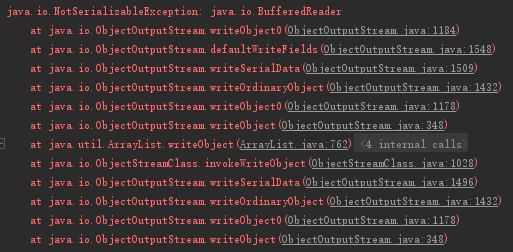

## 写在开始之前
为什么说是【旧文重发】，因为这是我在大一下学期的写的一篇文章。最近突然想开始写博客，觉得要维护一个Wordpress很麻烦，用Markdown写然后deploy在Github上似乎比较简单方便，所以以后的博文就放在Github上吧。
放假想开始学Kotlin，接下来可能会发一些与Kotlin学习相关的博文。至于学习和写博文能不能坚持下去，就以这篇博文为据，看到时候会不会打脸吧。

<!-- more -->

***

## 正文

### 实现类的Serializable

昨天在完成Java上机任务的遇到了要将一个存有对象的Arraylist对象存入文本文件。


百度了一下只要将类implement Serializable接口 就可以启用其序列化功能，并且父类实现了序列化子类就不再需要接入序列化接口。就像下面这样。

```
abstract class Person implements Serializable  {
    ......
}
```

而ArrayList类本身就已经实现了Serializable


然后理论上用writeObject()方法和readObject()方法即可将Arraylist对象存入文件。于是我在抽象类Tools中封装了两个静态方法：

```
abstract class Tools {
    static void writeFile(Object obj) throws IOException {
        File file = new File("person.dat");
        FileOutputStream out;
        try {
            out = new FileOutputStream(file);
            ObjectOutputStream objOut = new ObjectOutputStream(out);
            objOut.writeObject(obj);
            objOut.close();
        } catch (IOException e) {
            e.printStackTrace();
        }
    }

    static Object readFile() throws IOException {
        Object temp = null;
        File file = new File("person.dat");
        FileInputStream in;
        try {
            in = new FileInputStream(file);
            ObjectInputStream objIn = new ObjectInputStream(in);
            temp = objIn.readObject();
            objIn.close();
        } catch (IOException | ClassNotFoundException e) {
            e.printStackTrace();
        }
        return temp;
    }
    ......
}
```

定义并实例Arraylist对象：

```
ArrayList<Person> list = new ArrayList<>();
```

调用方法，将Arraylist传入：
```
Tools.writeFile(list);
```

```
list = (ArrayList<Person>) Tools.readFile();
```

其实不知道为什么在读文件的方法Intellij IDEA会提示下面Warning：

    Unchecked cast: 'java.lang.Object' to 'java.util.ArrayList<Person>' less... (Ctrl+F1) 
    Signals places where an unchecked warning is issued by the compiler, for example:

    void f(HashMap map) {
    map.put("key", "value");
    }
  
    Hint: Pass -Xlint:unchecked to javac to get more details.
    

但是运行的时候是没有问题的。

### 接下来是用的时候踩过的一些坑：

在第一次运行的时候出现了这样的报错：



一开始没认真看报错而摸不着头脑后来发现报错的原因第一行就是：
    java.io.NotSerializableException: java.io.BufferedReader

原来我在Person类中实例了InputStreamReader和BufferedReader对象给本类和子类调用：

```
InputStreamReader ir = new InputStreamReader(System.in);
BufferedReader in = new BufferedReader(ir);
```

虽然感觉这样子用本身上会有问题但是写个上机作业应该还是没啥问题的，结果这两个对象不能序列化。解决办法也很简单，就是将这两个对象删掉然后在每个要用到的方法中再新建。然后就写文件没有问题了。

还有就是在读文件时，一开始我的方法是这样子写的：

```
    static void readFile(ArrayList<Person> list) throws IOException {
        Object temp = null;
        File file = new File("person.dat");
        FileInputStream in;
        try {
            in = new FileInputStream(file);
            ObjectInputStream objIn = new ObjectInputStream(in);
            temp = objIn.readObject();
            objIn.close();
        } catch (IOException | ClassNotFoundException e) {
            e.printStackTrace();
        }
        list = (ArrayList<Person>) temp;
    }
```
会有和上面一样的Warning，但是，接下来list并不能得到原来存入文件的ArrayList对象，但是并没有报错。以致我并不能获取原本存在ArrayList中的对象。然后乖乖改成上面最后的那样写法，就没问题了。


### 讲在最后
学习计科已经一年了，感觉编程真的很有意思。只是可能还是Too young, too simple 才会犯这样那样的一些错踩这样那样的坑。但是编程还是要学下去，毕竟这是我热爱的东西。
